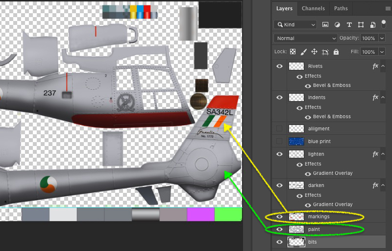
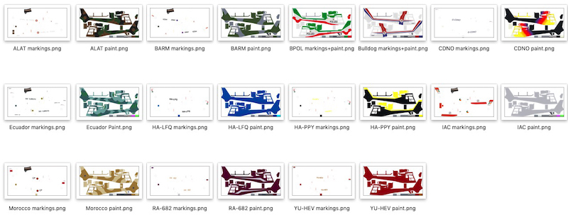
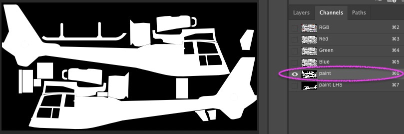
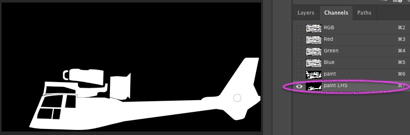
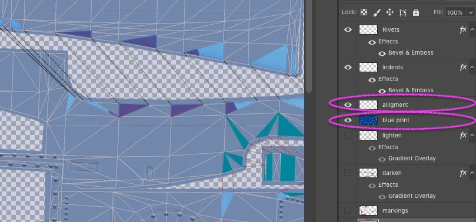
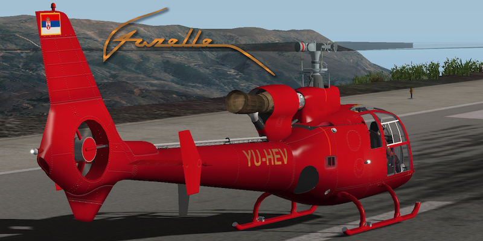

## GAZL paint kit for fuselage.png

There are probably only two layers that you will need to work on:

Examples are to be found in the GAZL_fuselageFiles folder

In the Channels section, the mask called **paint** can be used for the base coat colour

The mask called **paint LHS** is useful for creating the colour scheme 

and then, once completed, it can be copied, flipped and pasted into the upper right hand side base coat.  That way there is a pretty good chance that both sides will line up

Speaking of which, back in the layers section the **alignment** and **blue print** layers can be used to show the individual surfaces of the model and how they align. The main rotor gearbox fairing area is particularly tricky:

Look at the examples for help and inspiration . . . 

Enjoy!
